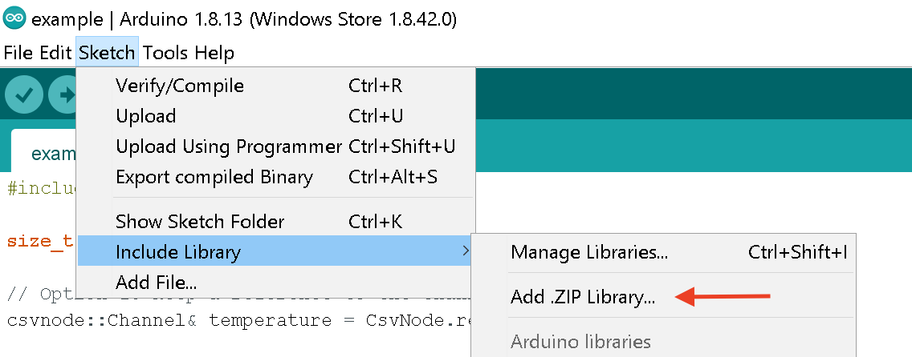
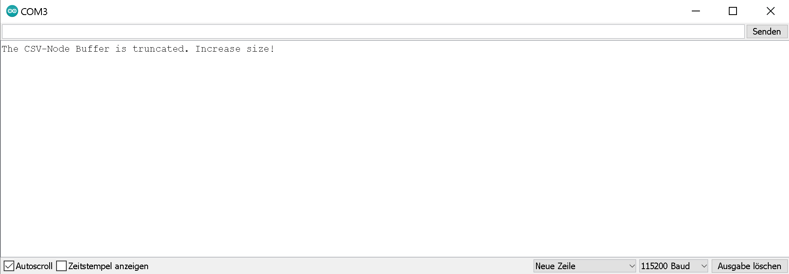

# A CSV-Node library for OXYGEN
With this library, you can send well-formatted CSV-Strings to [OXYGEN](https://www.dewetron.com/products/oxygen-measurement-software/) and any other serial monitor software. It offers a simple, Arduino-Like API. The OXYGEN measurement software is the most intuitive, all-in-one software in the data acquisition sector for measurement, visualization, and analysis for many applications.

The library implements the advananced CSV-Protocol options as specified by the corresponding OXYGEN-DEWETRTON Plugin. It  can be used to send simple CSV-Data as well as complex header request to the OXYGEN Plugin. The library is compatible with the Arduino Library system as well as platform.io as it implements the necessary [folder-structure](https://arduino.github.io/arduino-cli/latest/library-specification/). In addition, it can be easily embedded and used in any other project. The only prerequisite is C++11 compiler. **In addition, the plugin makes the great Embedded-Template-Library (ETL) available to your project.** 


# Build steps for Arduino IDE
Run `create_arduino_library.py` to create a library useable with the Arduino IDE (Python 3.8 or higher required). The python script creates a compressed directory: `embedded-serial-csv.zip`

Copy `embedded-serial-csv.zip` to the Arduino library directory and extract it. In Windows this is `%HOME%\Documents\Arduino\libraries`. Then open the example sketch and verify/compile.

Alternativly, you can install the library using the Arduino-IDE:


<p align="center">
    
</p>


# Usage on Arduino

The following example summarizes the usage of the Plugin in a simple sketch:

```c++
#include <CsvNode.h>

size_t VOLTAGE = -1;

// Option 1: Keep a reference to the channel
csvnode::Channel& temperature = CsvNode.registerChannel("Temperature");

void setup() {
  // put your setup code here, to run once:
  
  // Setup Node-Name, Baudrate and Sampling-Interval (on the default Arduino-Monitor-Port)
  CsvNode.begin("Test-Node", 115200, 100);

  // Option 2: Simply register the channel and access later by name
  CsvNode.registerChannel("Current")
  .setUnit("[A]")
  .setMin(-20)
  .setMax(23.2);

  // Option 3: Get the Identifier/Index of the Channel during registration
  CsvNode.registerChannel("Voltage", &VOLTAGE)
  .setUnit("[V]");

  // Enable Timestamp-Prefix
  CsvNode.enablePrefixTimestamp();
}

void loop() {
  // put your main code here, to run repeatedly:

  // Option 1: Access per Reference
  temperature.logValue(random(-10, 60));
  // Option 2: Access per Name
  CsvNode.getChannel("Current").logValue(random(-20, 23.2));
  // Option 3: Access per Identifier
  CsvNode[VOLTAGE].logValue(random(0, 30));
  
  // Ensure node can do its work
  CsvNode.run();
}

```

The library provides a default `CsvNode` which takes ownership of the default Arduino serial port.

# Implementing another Hardware-System

To customize hardware support, one must simply provide the following structures to the SerialCsvNode template:

```C++
struct CustomSerial
{
    void write(const char *c, size_t length)
    {
        // write the given bytes to the serial port
    }

    int read()
    {
        // read a single byte
        return byte;
    }

    unsigned int available()
    {
        // return the number of available bytes
        return available;
    }

    void begin(const unsigned long baudrate)
    {
        // if necessary, set the baudrate
    }
};

struct CustomClock
{
    // Provide the actual datatype for milliseconds
    using milliseconds = unsigned long;
    Clock()
    {
        // Set offset to current time
        offset = now();
    }

    milliseconds now()
    {
        // Return monotonic increasing timepoint in milliseconds
        return millis() - offset;
    }

    void reset()
    {
        // Set offset to now() so that time now() begins at zero again
        offset = now();
    }
    
    // Store the offset
    milliseconds offset;
};

// Now the define the custom type
using CustomCsvNode = csvnode::SerialCsvNode<CustomClock, CustomSerial>;
```

# Memory and Customization

The library does not allocate any dynamic memory. The buffers for outgoing and incoming strings are implemented as static allocated arrays, names and units are stored as string literals.

The `CsvNode` default settings are:

- `NUM_CHANNELS` The library reserves memory for 5 channels
- `DECIMAL_PRECISION` The library sends floating points with a decimal precision of 2
- `OUTGOING_BUFFER_SIZE` The library reserves 100 characters in RAM to send strings 

 The library can be customised by creating a custom type:

```c++
#include <CsvNode.h>

// Create a Node with 10 Channels
using myCsvNodeType = csvnode::SerialCsvNode<csvnode::ArduinoClock, csvnode::ArduinoSerial, 10>;
myCsvNodeType myCsvNode;
```

The following parameters can be changed:

```c++
template <typename Clock,
          typename Serial,
          size_t NUM_CHANNELS = 5,
          uint32_t DECIMAL_PRECISION = 2,
          size_t OUTGOING_BUFFER_SIZE = 100,
         size_t INCOMING_BUFFER_SIZE = 10>
class SerialCsvNode
```


In addition, the following preprocessor definitions can be passed to the command line of the compiler to further customize the behavior

- **CSVNODE_EOL** 

  (default: "\n") the end of line character

- **CSVNODE_SEP** 

  (default: ",") the separator

Further information can be found in `CsvNodeProfile.h`.

# Error Management

The library has a custom error handling. When an error occurs (e.g. you are trying to get a channel which was not registered, the buffer for outgoing strings is running out of memory...), the library will write the error-string to the serial port and then stop execution of the program:



# Dependencies

The library takes advantages of the [Embedded Template Library](https://www.etlcpp.com/) which becomes available to the programmer by including the project. If you already are using an up-to-date version of the ETL, make sure it is available on the compilers include path and remove it from the libraries folder. 


# To-Dos and Known Issues
- If there is a need from users of the library, dependency on ETL shall be made optional
- **The Plugin undefines `min` and `max` macro!** (But ETL implements them, so simply use `etl::min` and `etl::max`)

