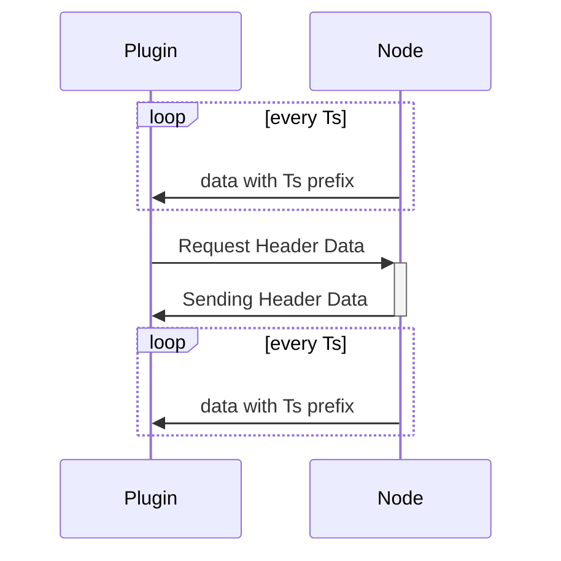
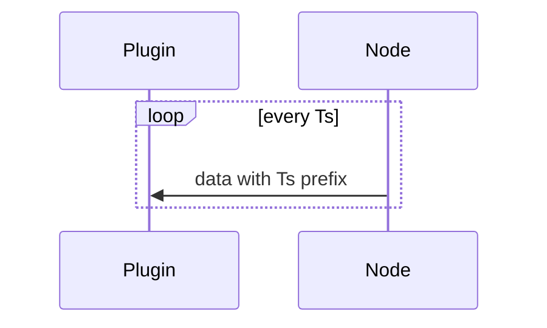
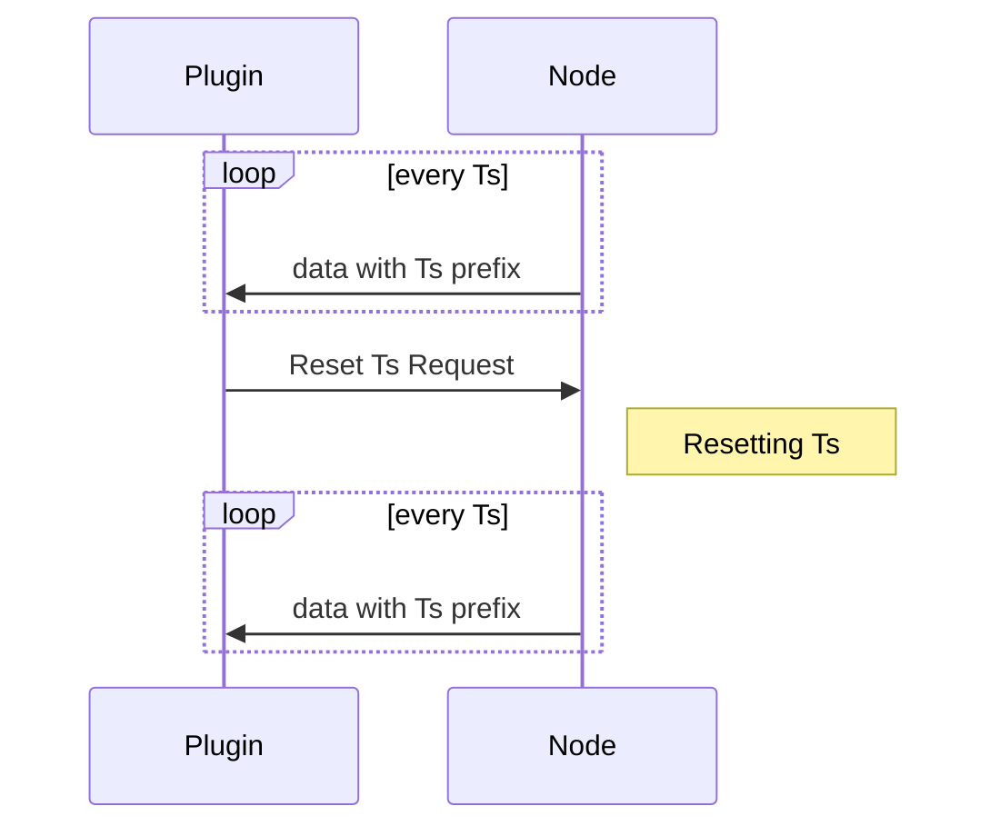

# Oxygen Serial-CSV-Plugin

The plugin allows to interpret incoming data from a serial port as OXYGEN source channels. Each line received on the serial port is interpreted as well formatted CSV string, where the following rules apply:

- Each individual value is comma-separated
- The decimal point is given as a dot
- Each line ends either with `\n` or `\r\n` 

The position within the CSV-String corresponds to the actual oxygen-channel. Hence, the sender should always transmit the same amount of individual values. Data on serial port COM5 might for example look like the following:

```
192.5,1.5,932.2,11.5\n
191.5,1.7,932.1,11\n
190.4,1.65,932.0,12\n
193.8,1.6,931,12.2\n
```

This will result in the following OXYGEN-Channels Structure:

- CSV-COM5
  - Channel#1
  - Channel#2
  - Channel#3
  - Channel#4

Where Channel#1-4 are automatically added to the root channel when data is received on the port - there is no further configuration necessary. The above example results in the following values per channel:

- Channel#1: 192.5, 191.5, 190.4, 193.8
- Channel#2: 1.5, 1.7, 1.65, 1.6
- Channel#3: 932.2, 932.1, 932.0, 931
- Channel#4: 11.5, 11, 12, 12.2

___

# Build status


# Advanced Protocol-Options

To further advance the Serial-CSV-Plugin, advanced protocol options are available. Each advanced option can be triggered by the following prefix: `#cmd:` followed by the actual CSV-Line. **Implementing these functions is completely optional so that the plugin behaves similar to the Arduino Serial Plotter without further protocol knowledge.** 

## Naming channels through header-data `#h:`

The plugin will give each channel a simple default name the user can override in OXYGEN. However, there is an option to transmit a channels actual name through CSV-Header-Data:

```
#h:Ampere,Temperature,Voltage,RMS\n
```

Will result in the following OXYGEN-Channel-Structure:

CSV-COM5

- Ampere
- Temperature
- Voltage
- RMS

In the following situations, the plugin might ask to transmit a header-line by sending `#h\n` to the node:

- When the plugin-instance is created 
- When the plugin is updating its settings
- When first csv-lines are received and header-data is missing

**Allowed characters for names**

- a-z
- A-Z
- 0-9
- Underscores
- Dash

The following example summarizes the header-data request:

```
Node to Plugin:
0,192.5,1.5,932.2,11.5\n
0,192.5,1.5,932.2,11.5\n
...

Plugin to Node:
#h\n

Node to Plugin:
#h:Ampere,Temperature,Voltage,RMS\n
0,192.5,1.5,932.2,11.5\n
0,192.5,1.5,932.2,11.5\n
...
```

<!---

--->

| Request-Summary          |             |
| ------------------------ | ----------- |
| Command                  | #h\n        |
| Response                 | Header-Data |
| Node must respond within | 300 mS      |

### Optional per-channel meta-data

The node can include additional meta-data in the header request to further parametrize Oxygen directly from the Node. The following per-channel meta-data entries are supported:

- Specifying a range by `#range:` followed by a dash-separated minimum and maximum of the current channel
- Specifying a minimum-value by `#min:` followed by the minimum-value of the current channel
- Specifying a maximum-value by `#max:` followed by the maximum value of the current channel
- Specifying a unit for the given Channel by `#u:` followed by the unit itself

The meta-data specifier directly follows the channel-name - but the **channel-name always goes first**. Hence, the given header-data

```
Node to Plugin:
0,192.5,1.5,932.2,11.5\n
0,192.5,1.5,932.2,11.5\n
...

Plugin to Node:
#h\n

Node to Plugin:
#h:Ampere#r:-5--2.2,Temperature#min:-20#u:°C,Voltage,RMS#max:102.5\n
0,192.5,1.5,932.2,11.5\n
0,192.5,1.5,932.2,11.5\n
...
```

will result in the following configuration:

| Channel-Name | Minimum | Maximum | Unit |
| ------------ | ------- | ------- | ---- |
| Ampere       | -5      | -2.2    | None |
| Temperature  | -20     | none    | °C   |
| Voltage      | none    | none    | None |
| RMS          | none    | 102.5   | None |

**Allowed characters for specifying a unit**

- a-z
- A-Z
- 0-9
- Underscores _
- Dash -
- Slash /
- Degree Symbol °

## Explicit Timestamp `#t:`

If no timestamp is given, the plugin will use the Host-OS timestamp for incoming data. However, this might not be precise enough. To allow millisecond precision for incoming data, each csv-row can be prefixed with a dedicated timestamp:

Reconsider the above example:

```
#t:0,192.5,1.5,932.2,11.5\n
#t:5,191.5,1.7,932.1,11\n
#t:10,190.4,1.65,932.0,12\n
#t:15,193.8,1.6,931,12.2\n
```

Will again result in four channels, however, each line carries a timestamp:

| Timestamp     | 0 mS  | 5 mS  | 10 mS | 15 mS |
| ------------- | ----- | ----- | ----- | ----- |
| **Channel#1** | 192.5 | 191.5 | 190.4 | 193.8 |
| **Channel#2** | 1.5   | 1.7   | 1.65  | 1.6   |
| **Channel#3** | 932.2 | 932.1 | 932.0 | 931   |
| **Channel#5** | 11.5  | 11    | 12    | 12.2  |

<!---

-->
## Reset Timestamp `#t0`

On Acquisition Restart (triggered at any time by Oxygen or the user), the plugin might ask to reset the timestamp to zero by transmitting `#t0\n` to the node.

<!---

--->
# Reserved Characters

Not every character can be used to give your channel a name or a unit as specific characters are reserved by the protocol. The allowed characters for names and units are pointed out in [Optional per-channel meta-data](#optional-per-channel-meta-data) and [Naming channels through header-data](#naming-channels-through-header-data-`#h:`).

# Using VS-Code to build and debug the plugin

To get started, Visual Studio Code with the following extensions can be used:
- The official C/C++ extension
- CMake Tools
- C++ TestMate to run Unit-Tests directly inside VS-Code

If you have OXYGEN installed on the default path and you start debugging, the compiled plugin gets automatically copied to the correct folder and OXYGEN is started. The Debugger will then attach to OXYGEN, allowing you to debug the plugin directly in VS-Code. To find out how this is done or how to change the default build-settings using the CMake extension, have a look at launch.json, settings.json and tasks.json.

